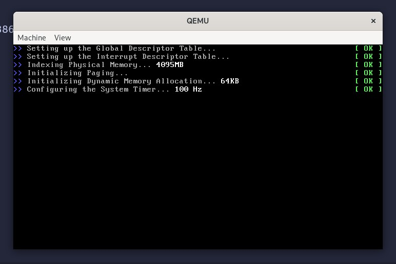
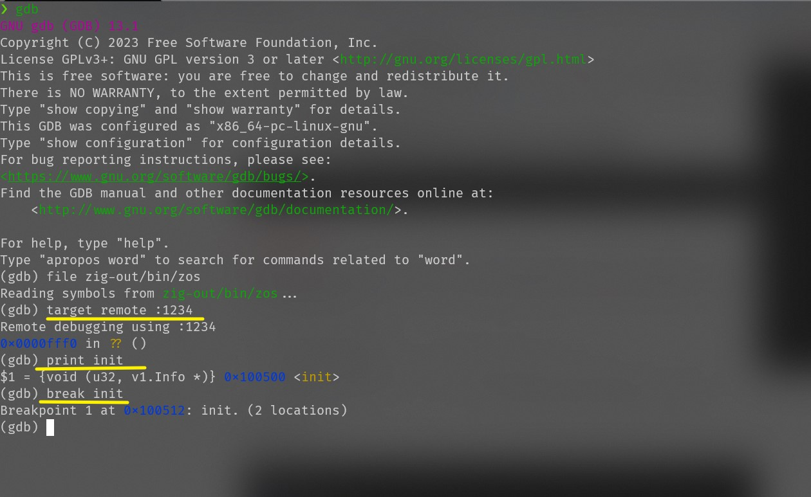

# Preface

Recently I was writing a 32-bit kernel with zig, it is so useful, and when I develop it, I meet some situations where I need to use debugger. But now, zig doesn't have official debugger.

I tried bochs and qemu separately, Finally decided to use qemu.

Qemu can debug with `GDB` remotely.

## Debug

My system is wsl `archlinux`, and I install `qemu-full` and gdb.

Here we only talk about how to debug. I will write a separate article to explain the relationship between operating system design.

### First, start qemu

we should start qemu, we can choose to start graphical or non-graphical

for examle:

```sh
qemu-system-x86_64 -kernel ./kernel -initrd  ./rootfs.img -append "nokaslr console=ttyS0" -s -S -nographic
```

The parameters of the command line are as follows:

-   _-kernel_ _./kernel_: start the specified elf kernel image
-   _-initrd_ _./rootfs.img_: in-memory file system started
-   _-append_ _"nokaslr console=ttyS0"_: additional parameters, "**nokaslr**" must be added to prevent randomization of the kernel start address, which will cause gdb breakpoints to fail to hit
-   _-s_: default listen on port 1234
-   _-S_: hang after startup, waiting for gdb connection
-   _-nographic_: no graph start

### Second, start gdb

After we start `qemu`, it will wait for the gdb connection

now, we should input gdb in terminal, like this:

```sh
[linux]$ gdb
(gdb) file zig-out/bin/zos      # file read the symbol table of kernel
(gdb) target remote :1234
(gdb) break init                # breakpoint, break and hbreak all ok
(gdb) c   						# start debug, kernel will stop at init
```



## Reference

-   [GDB Document](https://www.sourceware.org/gdb/documentation/)
