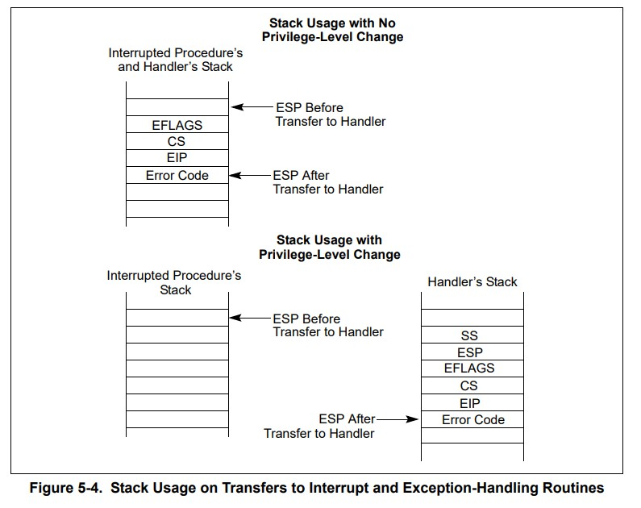

# Interrupt

Here's what happens when you use the INT instruction to push on the stack:

1. The CPU will query the interrupt vector table.
2. Then push some context information onto the stack,like this:

3. Then execute the interrupt handler function.
4. Then return through `iret`. Things to note here are that `iret` is only prepared for 16-bit systems. `iretd` should be used for 32-bit systems, and `iretq` should be used for 64-bit systems.

> IRET returns from an interrupt (hardware or software) by means of popping IP (or EIP), CS, and the flags off the stack and then continuing execution from the new CS:IP.
>
> IRETW pops IP, CS and the flags as 2 bytes each, taking 6 bytes off the stack in total. IRETD pops EIP as 4 bytes, pops a further 4 bytes of which the top two are discarded and the bottom two go into CS, and pops the flags as 4 bytes as well, taking 12 bytes off the stack.
>
> IRET is a shorthand for either IRETW or IRETD, depending on the default BITS setting at the time.
