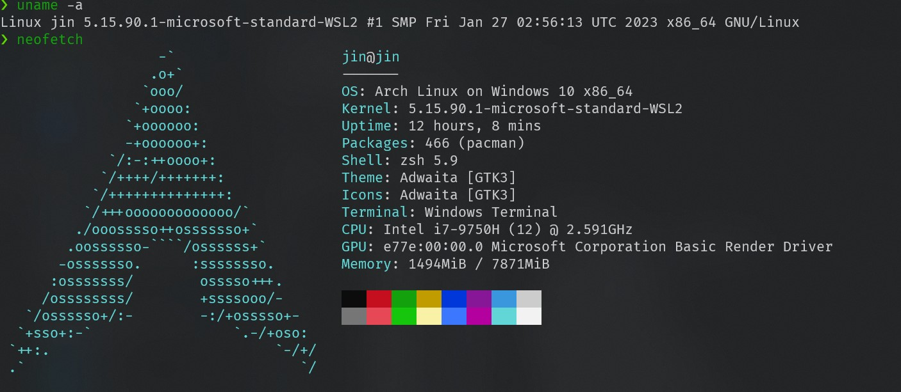

Recently, I switch to windows, because nvidia's support for linux is too poor, maybe usual using is ok, but when you shut down and check the system log, you will find many problems, such as slow shutdown, errors in the boot log.

So, I'm back in the windows camp. After a short experience, I found that the linux container of windwos is relatively mature now, I install archlinux on `wsl2`, it works very well!

<!--more-->



## Install

Now, I suggest you to use `windows11`, now it is very good, is a system suitable for everyday use!

About install `wsl2`, I don't want to say more, the docs of [microsoft docs](https://learn.microsoft.com/en-us/windows/wsl/install) is Very detailed

I just record some detail for my using for linux!

When we have installed wsl2, we can reboot system, and install the ArchWsl from the **microsoft store**, it will be configed automatically.

## Question

After installing, we will meet some error when install package, here is recorded!

**ldconfig: /usr/lib/wsl/lib/libcuda.so.1 is not a symbolic link**

_[Reference](https://github.com/yuk7/ArchWSL/issues/248)_

> Actually this is not relate to Arch, nor ArchWSL. It's caused by libcuda.so in your C:\Windows\System32\lxss\lib\ folder not a symbolic link, which is installed by nvidia driver. One solution to fuck the warning is delete libcuda.so and libcuda.so.1 and use make symbolic link to libcuda.so.1.1.

so, we can just do as this:

```cmd
C:
cd \Windows\System32\lxss\lib
del libcuda.so
del libcuda.so.1
mklink libcuda.so libcuda.so.1.1
mklink libcuda.so.1 libcuda.so.1.1
```

when you're done, it will look like this:

```cmd
C:\Windows\System32\lxss\lib> DIR
... ...
Mode                 LastWriteTime         Length Name
----                 -------------         ------ ----
la---           2023/3/31     4:34              0 libcuda.so -> libcuda.so.1.1
la---           2023/3/31     4:34              0 libcuda.so.1 -> libcuda.so.1.1
-a---           2023/3/17    16:32         154096 libcuda.so.1.1
-a---            2022/5/7    13:20         789192 libd3d12.so
-a---            2022/5/7    13:20        5913128 libd3d12core.so
-a---            2022/5/7    13:20         829248 libdxcore.so
-a---           2023/3/17    16:32       10411192 libnvcuvid.so
-a---           2023/3/17    16:32       10411192 libnvcuvid.so.1
-a---           2023/3/17    16:32       36576952 libnvdxdlkernels.so
-a---           2023/3/17    16:32         551528 libnvidia-encode.so
-a---           2023/3/17    16:32         551528 libnvidia-encode.so.1
-a---           2023/3/17    16:32         223048 libnvidia-ml.so.1
-a---           2023/3/17    16:32         362960 libnvidia-opticalflow.so
-a---           2023/3/17    16:32         362960 libnvidia-opticalflow.so.1
-a---           2023/3/17    16:32          68560 libnvoptix.so.1
-a---           2023/3/17    16:32       71873376 libnvwgf2umx.so
-a---           2023/3/17    16:32         634504 nvidia-smi
```

Then just finish your command you were running, such as `sudo pacman -S bat`

And remember to reboot the system

**Enable** `systemctl`

Now, wsl2 disable `systemctl`, we can easily enable this for every `wsl`, just add this to `/etc/wsl.conf`(It doesn't exist by default, you need to create it manually):

```conf
[boot]
systemd=true
```

If the following command returns systemd, it means that systemd has started

```
ps --no-headers -o comm 1
```

**Enable** mirror network:

After windows11 22H2, mirror network is available, just edit the `.wslconfig` (Default, this file does not exist, it must be created and stored in the `%UserProfile%` directory to apply these configuration settings).

```conf
[wsl2]
networkingMode=mirrored
firewall=true
dnsTunneling=true
autoProxy=true
```

More info, see [MicroSoft document](https://learn.microsoft.com/en-us/windows/wsl/wsl-config#wslconfig)